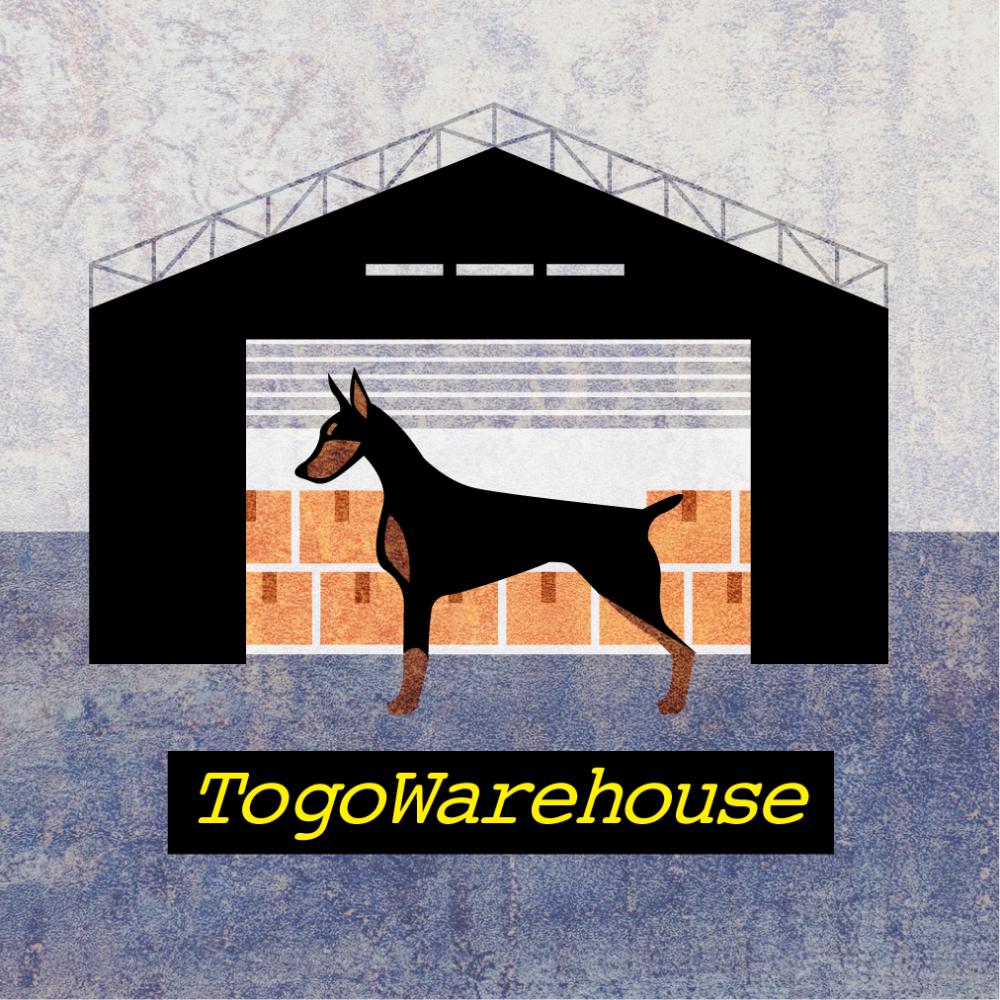

# TogoWarehouse

Togowarehouse is an utility tool to deploy a set of RDF/SPARQL tools developed in [DBCLS](https://dbcls.rois.ac.jp). Togowarehouse provides a set of components including RDF store, SPARQL query proxy server, and the other tools to improve the access to RDF data.

Togowarehouse runs these components:

- [Virtuoso OpenSource](https://github.com/openlink/virtuoso-opensource): A RDF store
- [SPARQL proxy](https://github.com/dbcls/sparql-proxy): A proxy server for SPARQL endpoint
- [Grasp](https://github.com/dbcls/grasp): A GraphQL interface over SPARQL endpoint
- [Endpoint Browser](https://github.com/moriya-dbcls/endpoint_browser): A visualization and utility tool to explore an RDF endpoint
- [nginx](https://nginx.org/) for frontend server

## Prerequisites

- [Docker-compose](https://docs.docker.com/compose/install/)

## Usage

Use `--recursive` to clone this repository with submodules:

```
git clone --recursive https://github.com/inutano/togowarehouse
```

Docker-compose to deploy the containers:

```
$ cd togowarehouse
$ mv /path/to/virtuoso.db ./db
$ docker-compose up -d
```

Then access `http://localhost:80` for SPARQL endpoint provided by [SPARQL proxy](https://github.com/dbcls/sparql-proxy).

## Contributors

- [Tazro Inutano Ohta](https://github.com/inutano), [DBCLS](https://dbcls.rois.ac.jp)
- [Yui Asano](https://github.com/yuyuyuOOO), [Swallow Design Studio](mailto:wowo14140@gmail.com)
